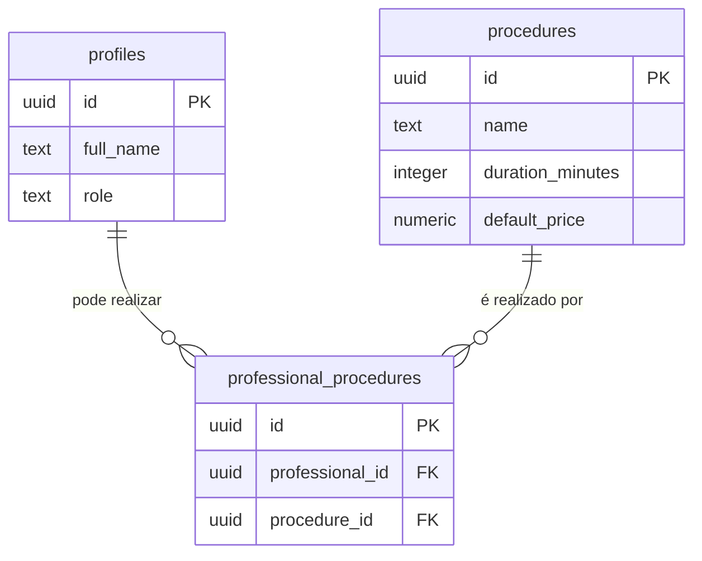

# 🔗 Feature: Associação Profissional-Procedimento

**Data**: 06/02/2026  
**Status**: ✅ IMPLEMENTADO  
**Tipo**: Feature Nova  

---

## 📋 Objetivo

Permitir que cada profissional tenha uma lista específica de procedimentos (serviços) que pode realizar. Isso garante que:
- Profissionais só possam agendar procedimentos que sabem executar
- Interface mostre apenas procedimentos relevantes para cada profissional
- Sistema evite agendamentos inválidos

---

## 🎯 Problema Resolvido

### Antes
- ❌ Todos os procedimentos apareciam para todos os profissionais
- ❌ Possível agendar serviços que o profissional não sabe fazer
- ❌ Lista confusa com muitos procedimentos irrelevantes

### Depois
- ✅ Cada profissional vê apenas seus procedimentos
- ✅ Agendamentos sempre válidos
- ✅ Interface limpa e relevante

---

## 🗄️ Arquitetura

### Relacionamento N:N



### Tabela de Junction

```sql
CREATE TABLE professional_procedures (
  id uuid PRIMARY KEY,
  professional_id uuid NOT NULL REFERENCES profiles(id),
  procedure_id uuid NOT NULL REFERENCES procedures(id),
  created_at timestamptz DEFAULT now(),
  UNIQUE (professional_id, procedure_id)
);
```

**Características**:
- Relacionamento N:N (muitos para muitos)
- Um profissional pode ter vários procedimentos
- Um procedimento pode ser feito por vários profissionais
- Constraint única previne duplicatas
- CASCADE DELETE limpa automaticamente ao deletar profissional/procedimento

---

## 📁 Arquivos Criados/Modificados

### 1. Migration: `20260206150000_add_professional_procedures.sql`

**O que faz**:
- Cria tabela `professional_procedures`
- Adiciona índices para performance
- Configura RLS policies
- Cria função helper `get_professional_procedures(uuid)`

**RLS Policies**:
```sql
-- Todos podem VER as associações (necessário para filtrar)
CREATE POLICY "Authenticated users can view professional procedures"
  ON professional_procedures FOR SELECT
  USING (true);

-- Apenas super_admin pode CRIAR/DELETAR associações
CREATE POLICY "Super admins can create professional procedures"
  ON professional_procedures FOR INSERT
  WITH CHECK (EXISTS (
    SELECT 1 FROM profiles
    WHERE profiles.id = auth.uid()
    AND profiles.role = 'super_admin'
  ));
```

**Função Helper**:
```sql
CREATE OR REPLACE FUNCTION get_professional_procedures(p_professional_id uuid)
RETURNS TABLE (
  id uuid,
  name text,
  duration_minutes integer,
  default_price numeric,
  is_active boolean
);
```

### 2. Seed: `supabase/seed.sql`

**Adicionado**:
- Seção de associações professional_procedures
- Primeiro usuário recebe TODOS os procedimentos (8)
- Demais usuários recebem especializações:
  - Usuário 2: Facial (Limpeza, Hidratação, Peeling, Acne)
  - Usuário 3: Corpo (Massagem, Drenagem)
  - Usuário 4+: Estética Rápida (Sobrancelha, Depilação)

**Código**:
```sql
-- Associar TODOS os procedimentos ao primeiro usuário
INSERT INTO professional_procedures (professional_id, procedure_id)
SELECT first_user_id, id
FROM procedures
WHERE is_active = true
ON CONFLICT DO NOTHING;

-- Usuário 2: Especialista em Facial
INSERT INTO professional_procedures (professional_id, procedure_id)
SELECT p.id, pr.id
FROM profiles p
CROSS JOIN procedures pr
WHERE p.id != first_user_id 
  AND pr.name IN ('Limpeza de Pele', 'Hidratação Facial', ...)
ON CONFLICT DO NOTHING;
```

### 3. Frontend: `src/pages/Agenda.tsx`

**Modificações**:

#### Função `loadProcedures()` refatorada:
```typescript
async function loadProcedures(profId: string) {
  const { data, error } = await supabase
    .from('professional_procedures')
    .select(`
      procedure_id,
      procedures:procedure_id (
        id,
        name,
        duration_minutes
      )
    `)
    .eq('professional_id', profId);

  const proceduresList = data
    ?.map((item: any) => item.procedures)
    .filter((proc: any) => proc !== null) || [];
  
  setProcedures(proceduresList);
}
```

#### useEffect para recarregar ao mudar profissional:
```typescript
useEffect(() => {
  if (professionalId) {
    loadProcedures(professionalId);
  }
}, [professionalId]);
```

#### UI: Ordem dos campos ajustada
- Super Admin: **Profissional** → Paciente → Procedimento
- Usuário comum: Paciente → Procedimento (profissional = usuário logado)

#### UI: Mensagens contextuais
```typescript
{!professionalId ? (
  <div className="bg-blue-50...">
    Selecione um profissional primeiro...
  </div>
) : procedures.length === 0 ? (
  <div className="bg-yellow-50...">
    Nenhum procedimento associado...
  </div>
) : (
  // Grid de procedimentos
)}
```

---

## 🎨 Fluxo de Usuário

### Usuário Comum (role: user)

1. **Abrir formulário de agendamento**
   - `professionalId` já definido (= usuário logado)
   - Procedimentos carregam automaticamente
   
2. **Ver apenas seus procedimentos**
   - Grid mostra apenas procedimentos associados
   - Se não tiver nenhum: mensagem amarela explicando
   
3. **Criar agendamento**
   - Só pode escolher entre seus procedimentos

### Super Admin (role: super_admin)

1. **Abrir formulário de agendamento**
   - Campo "Profissional" aparece primeiro
   - Lista de procedimentos vazia
   
2. **Selecionar profissional**
   - Procedimentos carregam dinamicamente
   - Grid atualiza com procedimentos daquele profissional
   
3. **Ver procedimentos do profissional selecionado**
   - Se não tiver: mensagem amarela
   - Se tiver: grid com os procedimentos
   
4. **Criar agendamento**
   - Apenas procedimentos válidos disponíveis

---

## 🧪 Testes

### Cenário 1: Usuário com Procedimentos
1. Logar como usuário comum
2. Abrir "Novo Agendamento"
3. **✅ Espera-se**: Ver lista de procedimentos imediatamente
4. Selecionar um procedimento
5. **✅ Espera-se**: Conseguir criar agendamento

### Cenário 2: Usuário SEM Procedimentos
1. Logar como usuário sem associações
2. Abrir "Novo Agendamento"
3. **✅ Espera-se**: Ver mensagem amarela explicando
4. **✅ Espera-se**: Botão "Agendar" desabilitado

### Cenário 3: Super Admin Muda Profissional
1. Logar como super_admin
2. Abrir "Novo Agendamento"
3. Selecionar "Profissional A"
4. **✅ Espera-se**: Ver procedimentos do Profissional A
5. Selecionar "Profissional B"
6. **✅ Espera-se**: Lista atualiza com procedimentos do Profissional B

### Cenário 4: Validar no Banco
```sql
-- Ver associações de um profissional específico
SELECT 
  prof.full_name,
  proc.name as procedure_name,
  proc.duration_minutes
FROM professional_procedures pp
JOIN profiles prof ON prof.id = pp.professional_id
JOIN procedures proc ON proc.id = pp.procedure_id
WHERE prof.id = 'UUID-DO-PROFISSIONAL'
ORDER BY proc.name;

-- Usar função helper
SELECT * FROM get_professional_procedures('UUID-DO-PROFISSIONAL');
```

---

## 📊 Dados de Exemplo (Seed)

| Profissional | Procedimentos | Especialização |
|--------------|---------------|----------------|
| **Primeiro usuário** | Todos (8) | Generalista |
| **Usuário 2** | Limpeza, Hidratação, Peeling, Acne | Facial |
| **Usuário 3** | Massagem, Drenagem | Corpo |
| **Usuário 4+** | Sobrancelhas, Depilação | Estética Rápida |

---

## 🚀 Como Aplicar

### 1. Rodar Migration
```bash
# A migration será aplicada automaticamente ao fazer push
# Ou execute manualmente no SQL Editor:
-- Cole o conteúdo de 20260206150000_add_professional_procedures.sql
```

### 2. Popular com Seed
```bash
# Execute o seed atualizado no SQL Editor
psql $DATABASE_URL < supabase/seed.sql
```

### 3. Verificar Associações
```sql
SELECT COUNT(*) FROM professional_procedures;
-- Deve retornar > 0

SELECT 
  prof.full_name,
  COUNT(pp.id) as total_procedures
FROM profiles prof
LEFT JOIN professional_procedures pp ON pp.professional_id = prof.id
WHERE prof.is_active = true
GROUP BY prof.id, prof.full_name
ORDER BY prof.full_name;
```

---

## 🎯 Futuras Melhorias (Sugestões)

### Curto Prazo
1. **Página de gerenciamento** (super_admin)
   - Lista de profissionais
   - Checkboxes para associar/desassociar procedimentos
   - Drag & drop para reordenar

2. **Validação no backend**
   - Trigger para garantir que agendamentos só sejam criados com associações válidas

### Médio Prazo
3. **Comissões por procedimento**
   - Porcentagem diferente por profissional/procedimento
   - Tabela `professional_procedure_commissions`

4. **Histórico de alterações**
   - Auditoria de quem adicionou/removeu associações
   - Timestamp de mudanças

### Longo Prazo
5. **Especialização dinâmica**
   - Profissional pode se "candidatar" a novos procedimentos
   - Super admin aprova/rejeita

6. **Certificações**
   - Anexar certificados aos procedimentos
   - Expiração/renovação de qualificações

---

## ⚠️ Considerações

### Performance
- ✅ Índices criados em `professional_id` e `procedure_id`
- ✅ Query otimizada com JOIN direto
- ✅ Sem N+1 queries

### Segurança
- ✅ RLS policies configuradas
- ✅ Apenas super_admin pode modificar associações
- ✅ Usuários comuns só leem

### Manutenção
- ⚠️ Ao deletar profissional: associações são deletadas (CASCADE)
- ⚠️ Ao deletar procedimento: associações são deletadas (CASCADE)
- ✅ Constraint UNIQUE previne duplicatas

---

## 📚 Referências

- [PostgreSQL Many-to-Many](https://www.postgresql.org/docs/current/tutorial-join.html)
- [Supabase RLS Policies](https://supabase.com/docs/guides/auth/row-level-security)
- [Junction Tables Best Practices](https://en.wikipedia.org/wiki/Associative_entity)

---

**Implementado por**: Assistente AI  
**Data**: 06/02/2026  
**Status**: ✅ Pronto para uso  
**Próximo passo**: Testar no navegador + Criar página de gerenciamento
