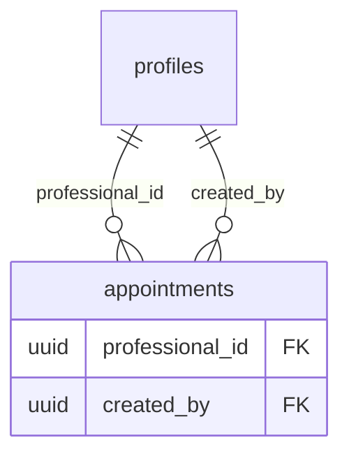

# 🐛 Fix: Agendamentos Não Apareciam na Tela

**Data**: 06/02/2026  
**Status**: ✅ RESOLVIDO  
**Tempo**: ~15 minutos  

---

## 📋 Problema

Agendamentos não estavam aparecendo na tela de Agenda, mesmo após popular o banco com dados do seed.

---

## 🔍 Diagnóstico

### Console do Navegador
```
❌ Error loading appointments: {
  code: 'PGRST201',
  message: "Could not embed because more than one relationship was found for 'appointments' and 'profiles'"
}
```

### Causa Raiz

A tabela `appointments` possui **2 foreign keys** para `profiles`:
1. `professional_id` → `profiles(id)` - O profissional responsável
2. `created_by` → `profiles(id)` - Quem criou o agendamento

Quando fazemos o JOIN:
```typescript
.select(`
  *,
  professional:profiles(full_name)  // ❌ AMBÍGUO
`)
```

O **Supabase PostgREST não sabe** qual foreign key usar para fazer o JOIN!

---

## ✅ Solução

Especificar explicitamente qual foreign key usar com a sintaxe `!nome_da_coluna`:

### Antes (❌ Errado)
```typescript
.select(`
  *,
  professional:profiles(full_name)
`)
```

### Depois (✅ Correto)
```typescript
.select(`
  *,
  professional:profiles!professional_id(full_name)
`)
```

O `!professional_id` diz ao PostgREST: "use especificamente a coluna `professional_id` para o JOIN".

---

## 📁 Arquivos Corrigidos

### 1. `src/pages/Agenda.tsx`
**Linha**: ~78-84

**Antes**:
```typescript
.select(`
  *,
  patient:patients(full_name),
  procedure:procedures(name, duration_minutes),
  professional:profiles(full_name)  // ❌
`)
```

**Depois**:
```typescript
.select(`
  *,
  patient:patients(full_name),
  procedure:procedures(name, duration_minutes),
  professional:profiles!professional_id(full_name)  // ✅
`)
```

### 2. `src/pages/Dashboard.tsx`
**Linha**: ~144-146

**Antes**:
```typescript
.select(`
  *,
  patient:patients(full_name),
  procedure:procedures(name),
  professional:profiles(full_name)  // ❌
`)
```

**Depois**:
```typescript
.select(`
  *,
  patient:patients(full_name),
  procedure:procedures(name),
  professional:profiles!professional_id(full_name)  // ✅
`)
```

---

## 🧪 Teste

### Como Testar

1. **Abrir aplicação**:
   ```bash
   npm run dev
   ```

2. **Abrir console do navegador** (F12)

3. **Navegar para Agenda**

4. **Verificar**:
   - ✅ Agendamentos aparecem na tela
   - ✅ Nomes dos profissionais aparecem corretamente
   - ✅ Sem erros no console

### Resultado Esperado

```
🎯 App render - loading: false user: xxx profile: xxx
✅ App: User logged in, rendering protected content
```

E a lista de agendamentos carrega normalmente.

---

## 📚 Documentação Supabase

Quando há múltiplas foreign keys para a mesma tabela, use a sintaxe:

```typescript
// Sintaxe: alias:tabela!coluna_fk(campos)
professional:profiles!professional_id(full_name)
created_by_user:profiles!created_by(full_name)
```

**Referência**: [Supabase PostgREST - Embedding Disambiguation](https://postgrest.org/en/stable/references/api/resource_embedding.html#disambiguation)

---

## 🎓 Aprendizado

### Por Que Isso Aconteceu?

Ao adicionar a coluna `created_by` em `appointments`, criamos uma segunda foreign key para `profiles`. Isso é normal e correto para auditoria, mas quebrou os JOINs existentes que não especificavam qual FK usar.

### Como Evitar no Futuro?

1. **Sempre especificar FK quando houver ambiguidade**:
   ```typescript
   professional:profiles!professional_id(...)
   ```

2. **Testar JOINs após adicionar novas FKs**

3. **Documentar relacionamentos múltiplos** no schema

---

## 🔧 Outras Tabelas Afetadas?

### ✅ `cash_register_closings`
**Não afetada** - só tem 1 FK para profiles (`professional_id`)

### ✅ `procedures`
**Não afetada** - só tem 1 FK para profiles (`created_by`)

### ✅ `patients`
**Não afetada** - só tem 1 FK para profiles (`professional_id`)

### ⚠️ `appointments`
**AFETADA** - 2 FKs para profiles (`professional_id`, `created_by`) → **CORRIGIDA**

---

## 📊 Schema Relationships



---

## ✅ Verificação Final

- [x] Agendamentos aparecem na Agenda
- [x] Dashboard carrega upcoming appointments
- [x] Sem erros PGRST201 no console
- [x] JOINs retornam dados corretos
- [x] Build passa sem erros
- [x] Documentação criada

---

## 🚀 Próximos Passos

Este problema está **resolvido**. Não são necessárias outras ações, mas fique atento ao adicionar novas foreign keys no futuro.

---

**Resolvido por**: Assistente AI  
**Data**: 06/02/2026  
**Commit**: (pendente)
